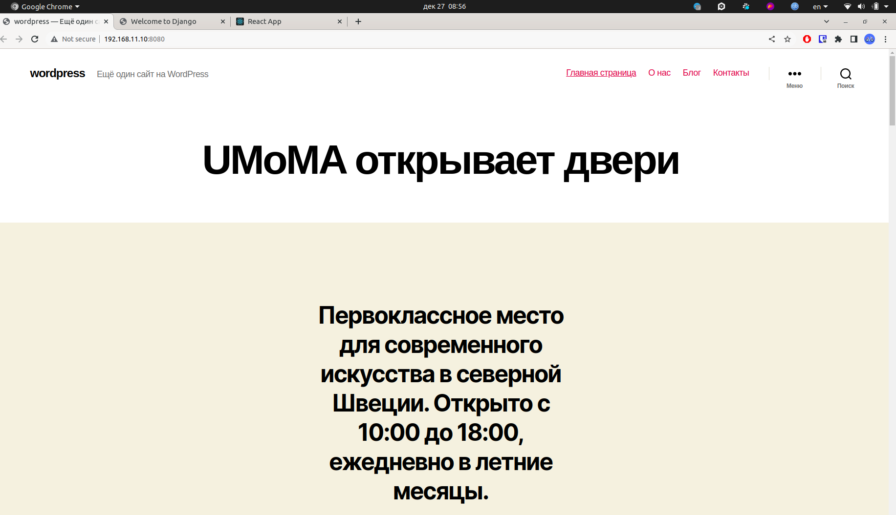
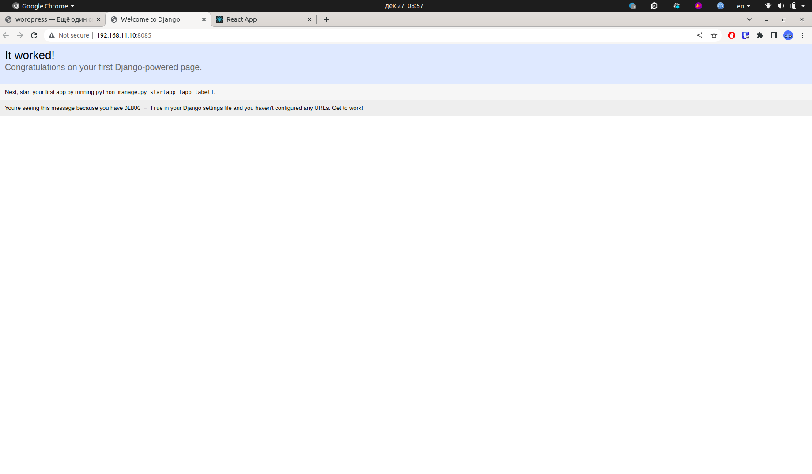
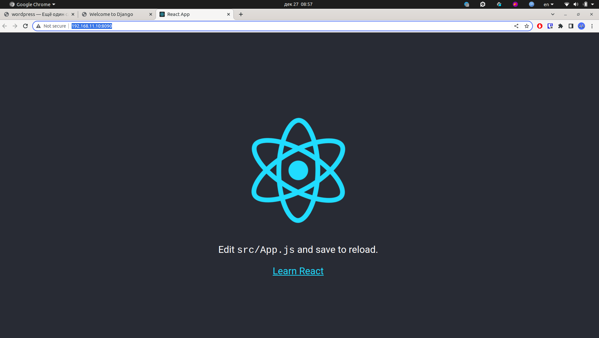

## Динамический WEB.

Для развертывания веб приложения подготовим сервер с сайтами:

- Wordpress (nginx + php-fpm)
- Django (nginx + python)
- React (nginx + php-fpm + js)

Поднимаем стенд `vagrant up`.

Wordpress
---------

В браузере открыть [http://192.168.11.10:8080/](http://192.168.11.10:8080/)

Django
------

В браузере открыть [http://192.168.11.10:8085/](http://192.168.11.10:8085/)

React
------------------------

В браузере открыть [http://192.168.11.10:8090/](http://192.168.11.10:8090/)

