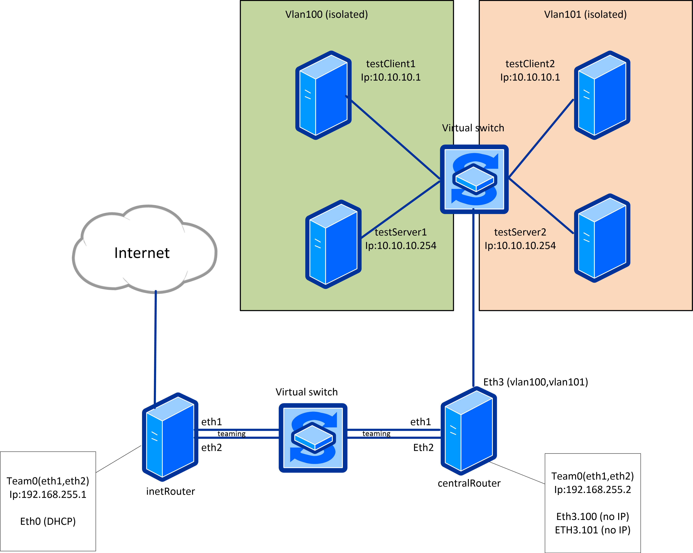

##  Сетевые пакеты. VLAN'ы. LACP 

После развертывания стенда командой ```vagrant up``` получаю следующую схему сети



Проверка Vlan 100
подключаемся сразу к трем хостам
```
otus_homework$ vagrant ssh testServer1
vagrant@testServer1:~$ ping 10.10.10.254
PING 10.10.10.254 (10.10.10.254) 56(84) bytes of data.
64 bytes from 10.10.10.254: icmp_seq=1 ttl=64 time=2.72 ms
64 bytes from 10.10.10.254: icmp_seq=2 ttl=64 time=0.957 ms
64 bytes from 10.10.10.254: icmp_seq=3 ttl=64 time=1.15 ms
64 bytes from 10.10.10.254: icmp_seq=4 ttl=64 time=1.10 ms
64 bytes from 10.10.10.254: icmp_seq=5 ttl=64 time=1.01 ms


otus_homework$ vagrant ssh testClient1
vagrant@testClient1:~$ sudo tcpdump
tcpdump: verbose output suppressed, use -v or -vv for full protocol decode
listening on vlan, link-type EN10MB (Ethernet), capture size 262144 bytes
09:17:56.147805 IP 10.10.10.1 > testClient1: ICMP echo request, id 1, seq 16, length 64
09:17:56.147921 IP testClient1 > 10.10.10.1: ICMP echo reply, id 1, seq 16, length 64
09:17:57.149663 IP 10.10.10.1 > testClient1: ICMP echo request, id 1, seq 17, length 64
09:17:57.149746 IP testClient1 > 10.10.10.1: ICMP echo reply, id 1, seq 17, length 64
09:17:58.151818 IP 10.10.10.1 > testClient1: ICMP echo request, id 1, seq 18, length 64
09:17:58.151883 IP testClient1 > 10.10.10.1: ICMP echo reply, id 1, seq 18, length 64
09:17:59.153747 IP 10.10.10.1 > testClient1: ICMP echo request, id 1, seq 19, length 64

otus_homework$ vagrant ssh testClient2
vagrant@testClient2:~$ sudo tcpdump
tcpdump: verbose output suppressed, use -v or -vv for full protocol decode
listening on vlan, link-type EN10MB (Ethernet), capture size 262144 bytes
^C
0 packets captured
0 packets received by filter
0 packets dropped by kernel

```

Проверка vlan 101
подключаемся сразу к трем хостам
```
otus_homework$ vagrant ssh testServer2
vagrant@testServer2:~$ ping  10.10.10.254
PING 10.10.10.254 (10.10.10.254) 56(84) bytes of data.
64 bytes from 10.10.10.254: icmp_seq=1 ttl=64 time=2.83 ms
64 bytes from 10.10.10.254: icmp_seq=2 ttl=64 time=1.03 ms
64 bytes from 10.10.10.254: icmp_seq=3 ttl=64 time=1.17 ms
64 bytes from 10.10.10.254: icmp_seq=4 ttl=64 time=1.18 ms
64 bytes from 10.10.10.254: icmp_seq=5 ttl=64 time=1.06 ms
64 bytes from 10.10.10.254: icmp_seq=6 ttl=64 time=1.19 ms
64 bytes from 10.10.10.254: icmp_seq=7 ttl=64 time=1.09 ms
64 bytes from 10.10.10.254: icmp_seq=8 ttl=64 time=0.620 ms

otus_homework$ vagrant ssh testClient2
vagrant@testClient2:~$ sudo tcpdump
tcpdump: verbose output suppressed, use -v or -vv for full protocol decode
listening on vlan, link-type EN10MB (Ethernet), capture size 262144 bytes
09:20:25.285916 IP 10.10.10.1 > testClient2: ICMP echo request, id 1, seq 5, length 64
09:20:25.285975 IP testClient2 > 10.10.10.1: ICMP echo reply, id 1, seq 5, length 64
09:20:26.299912 IP 10.10.10.1 > testClient2: ICMP echo request, id 1, seq 6, length 64
09:20:26.299972 IP testClient2 > 10.10.10.1: ICMP echo reply, id 1, seq 6, length 64
09:20:26.300104 ARP, Request who-has 10.10.10.1 tell testClient2, length 28
09:20:26.301033 ARP, Reply 10.10.10.1 is-at 08:00:27:b5:e1:d2 (oui Unknown), length 46
09:20:27.323940 IP 10.10.10.1 > testClient2: ICMP echo request, id 1, seq 7, length 64
09:20:27.323986 IP testClient2 > 10.10.10.1: ICMP echo reply, id 1, seq 7, length 64
09:20:28.325094 IP 10.10.10.1 > testClient2: ICMP echo request, id 1, seq 8, length 64
09:20:28.325131 IP testClient2 > 10.10.10.1: ICMP echo reply, id 1, seq 8, length 64
09:20:29.340251 IP 10.10.10.1 > testClient2: ICMP echo request, id 1, seq 9, length 64
09:20:29.340298 IP testClient2 > 10.10.10.1: ICMP echo reply, id 1, seq 9, length 64

otus_homework$ vagrant ssh testClient1
vagrant@testClient1:~$ sudo tcpdump
tcpdump: verbose output suppressed, use -v or -vv for full protocol decode
listening on vlan, link-type EN10MB (Ethernet), capture size 262144 bytes
^C
0 packets captured
0 packets received by filter
0 packets dropped by kernel
vagrant@testClient1:~$ 

```

Проверка bond 

```
igorbashta@NB-BASHTA:~/otus/otus_homework$ vagrant ssh centralRouter
Last login: Wed Jan 25 09:11:34 2023 from 10.0.2.2
[vagrant@centralRouter ~]$ ping 192.168.255.1
PING 192.168.255.1 (192.168.255.1) 56(84) bytes of data.
64 bytes from 192.168.255.1: icmp_seq=1 ttl=64 time=1.68 ms
64 bytes from 192.168.255.1: icmp_seq=2 ttl=64 time=1.16 ms
64 bytes from 192.168.255.1: icmp_seq=3 ttl=64 time=1.00 ms
^C
--- 192.168.255.1 ping statistics ---
3 packets transmitted, 3 received, 0% packet loss, time 2003ms
rtt min/avg/max/mdev = 1.002/1.281/1.683/0.293 ms
[vagrant@centralRouter ~]$ ifdown eth2
Users cannot control this device.
[vagrant@centralRouter ~]$ sudo ifdown eth2
[vagrant@centralRouter ~]$ ping 192.168.255.1
PING 192.168.255.1 (192.168.255.1) 56(84) bytes of data.
64 bytes from 192.168.255.1: icmp_seq=1 ttl=64 time=0.855 ms
64 bytes from 192.168.255.1: icmp_seq=2 ttl=64 time=1.01 ms
64 bytes from 192.168.255.1: icmp_seq=3 ttl=64 time=0.976 ms
^C
--- 192.168.255.1 ping statistics ---
3 packets transmitted, 3 received, 0% packet loss, time 2002ms
rtt min/avg/max/mdev = 0.855/0.949/1.017/0.073 ms
[vagrant@centralRouter ~]$ sudo ifup eth2

igorbashta@NB-BASHTA:~/otus/otus_homework$ vagrant ssh inetRouter
Last login: Wed Jan 25 09:12:02 2023 from 10.0.2.2
[vagrant@inetRouter ~]$ sudo ifdown eth2
[vagrant@inetRouter ~]$ ping 192.168.255.2
PING 192.168.255.2 (192.168.255.2) 56(84) bytes of data.
64 bytes from 192.168.255.2: icmp_seq=1 ttl=64 time=1.21 ms
64 bytes from 192.168.255.2: icmp_seq=2 ttl=64 time=0.906 ms
64 bytes from 192.168.255.2: icmp_seq=3 ttl=64 time=0.999 ms
^C
--- 192.168.255.2 ping statistics ---
3 packets transmitted, 3 received, 0% packet loss, time 2005ms
rtt min/avg/max/mdev = 0.906/1.039/1.213/0.131 ms

```
